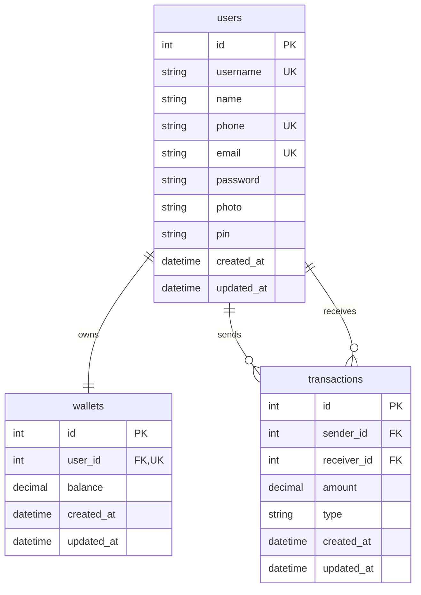

```mermaid
erDiagram
users ||--|| wallets : owns
users ||--o{ transactions : sends
users ||--o{ transactions : receives

users {
    int id PK
    string username UK
    string name
    string phone UK
    string email UK
    string password
    string photo
    string pin
    datetime created_at
    datetime updated_at
}

wallets {
    int id PK
    int user_id FK,UK
    decimal balance
    datetime created_at
    datetime updated_at
}

transactions {
    int id PK
    int sender_id FK
    int receiver_id FK
    decimal amount
    string type
    datetime created_at
    datetime updated_at
}
```
